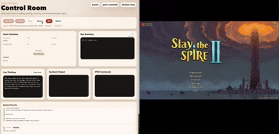

# STS2-Game2CLI

English README. For the Chinese version, see [README_ZH.md](README_ZH.md).

`STS2-Game2CLI` is an adapter layer that connects the real Steam version of *Slay the Spire 2* to a local CLI and agent harness.

<p align="center">
  
</p>

It works like this:

1. The in-game bridge mod `STS2_Bridge` runs inside the game process.
2. The mod exposes a local HTTP API at `http://localhost:15526/api/v1/singleplayer`.
3. The Python CLI `sts2` reads state and sends actions through that API.
4. The tools under `agent-harness/`, including `pi-agent` and the local frontend, reuse the same `sts2` command.

This project controls the real running game. It is not a headless simulator and it does not use screen automation.

## What Is Included

- `sts2cli/`
  - Python CLI adapter that provides the `sts2` command.
- `bridge/plugin/`
  - `.NET 9` source for the bridge mod.
- `bridge/install/`
  - Install bundle and scripts for the bridge mod.
- `agent-harness/pi-agent/`
  - Pinned `pi` runtime and loop runner.
- `agent-harness/frontend/`
  - Local browser control panel, listening on `127.0.0.1:8765` by default.

## Requirements

- A working Steam installation of *Slay the Spire 2*
- Python `>= 3.10`
- `.NET 9 SDK`
- `npm`
  - Only required if you want to use `pi-agent`

The bridge build and install scripts currently auto-detect the default macOS Steam path. If your game is installed elsewhere, pass the path explicitly or override it with an environment variable.

## Installation

### 1. Install the CLI

From the repository root:

```bash
python3 -m pip install -e .
```

This installs the `sts2` command.

If you only want to use the repo-local launcher, you can also run:

```bash
./sts2 --help
```

### 2. Build the bridge mod

```bash
cd bridge/plugin
./build.sh
```

The script tries to auto-detect the game data directory and refreshes the local install bundle at:

```text
bridge/install/bridge_plugin/
```

If auto-detection fails, set `STS2_GAME_DATA_DIR` or pass the directory directly:

```bash
STS2_GAME_DATA_DIR="/path/to/data_sts2_macos_arm64" ./build.sh
```

or:

```bash
./build.sh "/path/to/data_sts2_macos_arm64"
```

The target directory must contain at least:

- `sts2.dll`
- `GodotSharp.dll`
- `0Harmony.dll`

### 3. Install the bridge mod into the game

```bash
cd bridge/install
./install_bridge.sh
```

The default target path is:

```text
~/Library/Application Support/Steam/steamapps/common/Slay the Spire 2/SlayTheSpire2.app/Contents/MacOS/mods/STS2_Bridge/
```

If your game is not installed in the default location, pass the game root explicitly:

```bash
./install_bridge.sh "/path/to/Slay the Spire 2"
```

After installation, the game directory should contain:

```text
<game_install>/SlayTheSpire2.app/Contents/MacOS/mods/STS2_Bridge/STS2_Bridge.dll
<game_install>/SlayTheSpire2.app/Contents/MacOS/mods/STS2_Bridge/STS2_Bridge.json
```

### 4. Enable the mod in game

Launch the game and make sure `STS2_Bridge` is loaded and enabled. Once enabled, the mod listens on:

```text
http://localhost:15526/
http://127.0.0.1:15526/
```

The CLI uses this endpoint by default:

```text
http://localhost:15526/api/v1/singleplayer
```

### 5. Verify the setup

```bash
sts2 --help
sts2 state
```

If `sts2 state` returns JSON, the CLI and the bridge are connected correctly.

## Running And Usage

### Shortest path

1. Build and install `STS2_Bridge`
2. Launch the real game and enable the mod
3. Run `python3 -m pip install -e .` from the repository root
4. Run `sts2 state`

### Start from the main menu

The current code already supports continuing a save, starting a new run, abandoning a save, and returning to the main menu.

Examples:

```bash
sts2 state
sts2 continue-game
sts2 start-game --character IRONCLAD --ascension 0
sts2 abandon-game
sts2 return-to-main-menu
```

`start-game --character` currently recognizes:

- `IRONCLAD`
- `SILENT`
- `DEFECT`
- `NECROBINDER`
- `REGENT`

### Manual control during a run

```bash
sts2 state
sts2 choose-map 0
sts2 play-card 0 --target jaw_worm_0
sts2 end-turn
sts2 claim-reward 0
sts2 pick-card-reward 0
sts2 rest 0
sts2 event 0
sts2 repl
```

Common command groups:

- State inspection: `state`, `raw-state`
- Menu actions: `continue-game`, `start-game`, `abandon-game`, `return-to-main-menu`
- Combat: `play-card`, `use-potion`, `end-turn`
- Map and rooms: `choose-map`, `event`, `advance-dialogue`, `rest`, `proceed`
- Rewards and overlays: `claim-reward`, `pick-card-reward`, `skip-card-reward`, `select-card`, `confirm-selection`, `select-relic`

For the full command surface:

```bash
sts2 --help
```

## Agent Harness

### `pi-agent`

Install the pinned runtime first:

```bash
bash agent-harness/pi-agent/setup_pi_agent.sh
```

Then prepare the root `.env` file:

```bash
cp .env.example .env
```

Minimal example:

```bash
PI_PROVIDER=openrouter
PI_MODEL=auto
OPENROUTER_API_KEY=sk-or-...
PI_CODING_AGENT_DIR=/absolute/path/to/STS2-Game2CLI/.agents/pi-home
```

Start the runner:

```bash
bash agent-harness/pi-agent/run_pi_sts2_agent.sh
```

Temporarily override the provider or model:

```bash
bash agent-harness/pi-agent/run_pi_sts2_agent.sh --provider openai --model <tool-capable-model>
```

Prerequisites:

- The `sts2` command is available
- `sts2 state` can already connect to the game
- Your provider and API key are configured in `.env`

Logs are written to:

```text
logs/pi-agent/<timestamp>/
logs/pi-agent/latest
```

### Local frontend control panel

Start it with:

```bash
bash agent-harness/frontend/start.sh
```

Default URL:

```text
http://127.0.0.1:8765
```

Optional arguments:

```bash
python3 agent-harness/frontend/server.py --host 127.0.0.1 --port 8765
```

The frontend reads the root `.env` file and uses the local control service to start `pi-agent`, inspect the latest game state, and record memory data.

## Configuration

### CLI

- `--base-url`
  - Default: `http://localhost:15526`
- `--timeout`
  - Default: `10.0`

Example:

```bash
sts2 --base-url http://127.0.0.1:15526 --timeout 20 state
```

### Bridge build

- `STS2_GAME_DATA_DIR`
  - Use this when `bridge/plugin/build.sh` cannot auto-detect the game data directory

### `pi-agent` / frontend `.env`

- `PI_PROVIDER`
  - Default provider
- `PI_MODEL`
  - Default model
- `OPENROUTER_API_KEY`
  - Required when the provider is `openrouter`
- `PI_CODING_AGENT_DIR`
  - Local working directory for `pi`; defaults to `./.agents/pi-home`
- `PI_BASE_URL`
  - Optional custom provider base URL
- `PI_API_KEY_ENV`
  - Used with `PI_BASE_URL` to tell the runner which environment variable holds the API key
- `STS2CLI_ENV_FILE`
  - Optional override for the `.env` file used by `run_pi_sts2_agent.sh`
- `STS2_BIN`
  - Optional explicit path to the `sts2` executable

When `PI_BASE_URL` is set, the runner automatically writes a provider override into `PI_CODING_AGENT_DIR/models.json`.

## Troubleshooting

### `sts2 state` cannot connect

This usually means one of the following is still missing:

- The game is not running
- `STS2_Bridge` is not installed or not enabled
- The local API on `localhost:15526` is not up yet

### `bridge/plugin/build.sh` cannot find the game directory

Confirm that the game is installed, then pass `STS2_GAME_DATA_DIR` explicitly:

```bash
STS2_GAME_DATA_DIR="/path/to/data_sts2_macos_arm64" ./bridge/plugin/build.sh
```

### `pi-agent` says the runtime is not installed

Run:

```bash
bash agent-harness/pi-agent/setup_pi_agent.sh
```

### The frontend does not start

Check these three commands independently:

```bash
sts2 --help
sts2 state
python3 agent-harness/frontend/server.py --help
```

## Related Docs

- [docs/INSTALL.md](docs/INSTALL.md)
- [docs/BRIDGE_PLUGIN.md](docs/BRIDGE_PLUGIN.md)
- [docs/BRIDGE_API.md](docs/BRIDGE_API.md)
- [docs/HOW_TO_DO.md](docs/HOW_TO_DO.md)
- [bridge/plugin/README.md](bridge/plugin/README.md)
- [agent-harness/pi-agent/README.md](agent-harness/pi-agent/README.md)
- [agent-harness/frontend/README.md](agent-harness/frontend/README.md)

## Credits

This project was informed by:

- [`wuhao21/sts2-cli`](https://github.com/wuhao21/sts2-cli)
- [`Gennadiyev/STS2MCP`](https://github.com/Gennadiyev/STS2MCP)
- [`HKUDS/CLI-Anything`](https://github.com/HKUDS/CLI-Anything)
